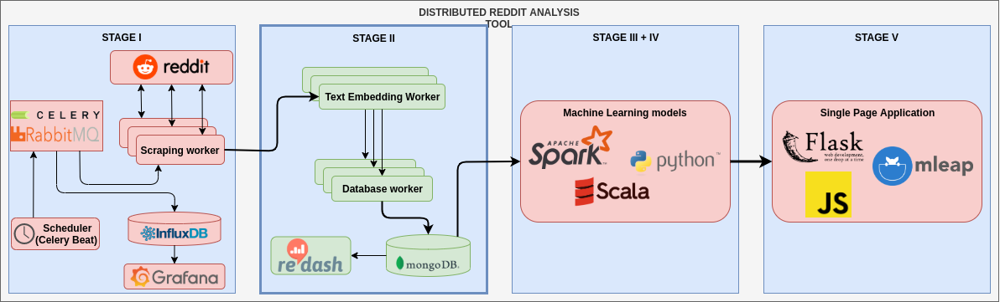

# L3 - 2019

## Scope
1. Text embedding
2. Data persistency (MongoDB)
3. Data analysis (Redash)

## Tasks
Implement the second stage of the following architecture:

Detailed information about components can be found in the further tasks.

For each task make sure that `tox` passes.

**Please do not modify the provided tox manifest!**

0. **Preparation** Copy appropriate source code from the previous task into this repository and update the docker-compose manifest.
1. **Data model** Implement a data model for Reddit posts, it should contain at least the following fields:
    - original URL
    - author name
    - subreddit name
    - post text
    - post text embedding
    - number of votes
    - whether this post belongs to NSFW category
    - number of comments
2. **Text Embedding Worker**
    - choose a text embedding algorithm (e.g. GloVe, ELMO, FastText, Word2Vec), check out `magnitude` library
    - implement a new Celery worker task
    - it should be called from the Scraper Worker after a new post was downloaded
    - can the task be called without importing the actual function?
    - using the chosen algorithm calculate the text embedding and save it to the received data model (task argument)
    - return the updated data model
    - use a separate queue for this worker
3. **Database Worker**
    - add MongoDB to the docker-compose manifest (don't forget about data persistency and credentials)
    - implement a new Celery woker task
    - it should either be called from the Text Embedding Worker or from the Scraper Worker (how to call multiple task sequentially?)
    - input arguments: data model
    - it should save the data model to a collection in MongoDB
    - decide whether to use a stateful database connection or open/close the connection on each task call (stateless db connection)
    - use a separate queue for this worker
4. **Data visualization**
    - add Redash to the docker-compose manifest (don't forget about data persistency and credentials)
    - visualize following statistics:
        - number of posts in subreddits 
        - number of subreddits
        - Reddit posts lengths
5. (nice to have) **Improve your code** 
    - using Python's dataclass API reimplement the data model for Reddit posts
    - check out Python styleguides - which one do we use in the provided tox manifest?
    - check out `tox` documentation - which other jobs could we implement in our code?
    - where feasible use type hints in your code, it can help you and your IDE to identify potential bugs (e.g. wrong variable types)
    - check out `mypy` (a tool for static code analysis using type hints) - try to implement a new `tox` job which runs `mypy`
    - try to separate code into feasible modules and build separate Docker images for each worker


## Notes
### Database connection

```shell script
$ docker exec -it mongodb bash
/# mongo -u root -p
> show dbs
> use reddit
> show colletions
> coll = db.posts
> coll.find().count()
```

### Docker compose multiple files
```shell script
docker-compose -f docker-compose.yaml -f redash/docker-compose.yml up
```

### Redash server

localhost:5000

### Redash docker create DB
```shell script
# Create tables
docker-compose run --rm server create_db

# Create database for tests
docker-compose run --rm postgres psql -h postgres -U postgres -c "create database tests"
```

### Redash MongoDB quieries

Number of posts in subreddits
```json
{
	"collection": "posts",
	"aggregate": [{
		"$unwind": "$subreddit"
	}, {
		"$group": {
			"_id": "$subreddit",
			"count": {
				"$sum": 1
			}
		}
	}, {
		"$sort": [{
			"name": "count",
			"direction": -1
		}, {
			"name": "_id",
			"direction": -1
		}]
	}]
}
```
Post length
```json
{
	"collection": "posts",
	"aggregate": [{
		"$unwind": "$title_length"
	}, {
		"$group": {
			"_id": "$title_length",
			"count": {
				"$sum": 1
			}
		}
	}, {
		"$sort": [{
			"name": "count",
			"direction": -1
		}, {
			"name": "_id",
			"direction": -1
		}]
	}]
}
```
Over 18 filter
```json
{
	"collection": "posts",
	"aggregate": [{
		"$project": {
			"_id": "$_id",
			"over_18::filter": "$over_18",
			"subreddit": "$subreddit",
			"title": "$title"
		}
	}]
}
```
