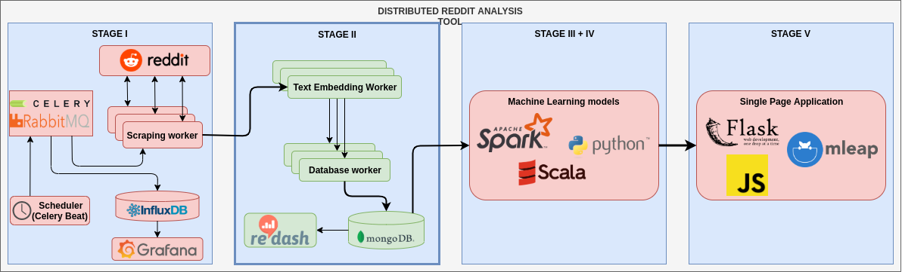

# L4 - 2019

## Scope
1. pySpark
2. Linear regression
3. Binary classification
4. Multi-class classification

## Tasks
Implement the third stage of the following architecture:

Detailed information about components can be found in further tasks.

For each task make sure that `tox` passes.

**Please do not modify the provided tox manifest!**

0. **Preparation** 

    Copy appropriate source code from the previous task into this repository to be able to access gathered data

1. **Start questions**

    - [Guide](https://spark.apache.org/docs/latest/ml-guide.html)
    - why do we need to install Java, how pySpark works?
        - "PySpark is built on top of Spark's Java API. Data is processed in Python and cached / shuffled in the JVM" 
        (https://cwiki.apache.org/confluence/display/SPARK/PySpark+Internals)
    - do we need to use Java 8
        - Yes, because "support for Java 7, Python 2.6 and old Hadoop versions before 2.6.5 were removed as of Spark 2.2.0."
        (https://spark.apache.org/docs/latest/)
    - can we connect to an external cluster from python code
        - Yes (https://docs.faculty.ai/how_to/spark/external_cluster.html)
    - can we deploy our python code to Spark cluster
        - Yes, using spark-submit
    - how can we observe Spark jobs progress (Spark HTTP UI)
        - on localhost, port 4040 (https://jaceklaskowski.gitbooks.io/mastering-apache-spark/spark-webui.html)
    - logistic regression vs linear regression
        - logistic = classes (2 or more)
        - linear = real numbers
    - multi-class vs multi-label
        - multi-class = more than 2 classes
        - multi-label = each sample can have more than 1 class
    - Spark:
        - what is RDD
            - "resilient distributed dataset (RDD), which is a collection of elements partitioned across the nodes of the cluster that can be operated on in parallel"
            (https://spark.apache.org/docs/latest/rdd-programming-guide.html)
        - what is DataFrame
            - "A DataFrame is a Dataset organized into named columns. It is conceptually equivalent to a table in a relational database or a data frame in R/Python, but with richer optimizations under the hood."
            (https://spark.apache.org/docs/latest/sql-programming-guide.html)
        - what is DataSet
            - "A Dataset is a distributed collection of data. Dataset is a new interface added in Spark 1.6 that provides the benefits of RDDs (strong typing, ability to use powerful lambda functions) with the benefits of Spark SQL’s optimized execution engine."
            (https://spark.apache.org/docs/latest/sql-programming-guide.html)
        - how Spark generally works (master, worker)
        - Spark stack (SQL, ML, GraphX etc.)
        - shuffling
            - for wide dependencies, ex. join, groupBy
            - redistributing data across partitions
            - mostly we want to avoid it, because it's costly
        - [reduceByKey vs groupByKey](https://jaceklaskowski.gitbooks.io/mastering-apache-spark/spark-rdd-shuffle.html)
            - reduceByKey is generally better, because it reduces the amount of data transfered between nodes

2. **Spark installation** 

    Update Dockerfile and docker-compose:
    - download and instal Spark
    - run code using pySpark command

3. **MongoDB connection** 

    Read data from mongodb using SparkSQL and appropriate connector. 

    - You need to add jar to Spark runtime, use --packages flag for pySpark
    - mongodb needs to be a separate service in docker-compose, utilize appropriate directives to get connections

4. **Data split** 

    Divide data into training and testing sets using some criterion (date of acquisition, first n items)

    - you can use appropriate ready to use the class from Spark

5. **Regression**

    Create regression pipeline:

    - select a submission attribute that we want to be our dependent variable
    - map data to contain a dependent variable and features vector columns
    - create ML pipeline
    - evaluate your regressor using RMSE on train and test sets

6. **Binary classification**

    Create a binary classification pipeline:

    - select a submission attribute that we want to be our class
    - map data to contain class and features vector columns
    - create ML pipeline
    - evaluate your classifier computing F1 metric

6. **Multi-class classification**

    Create a multi-class classification pipeline:

    - select a submission attribute that we want to be our class (multi-class)
    - map data to contain class and features vector columns
    - create ML pipeline
    - evaluate your classifier using MulticlassClassificationEvaluator
    
    
## Notes

Change embedding to magnitude

```bash
python -m pymagnitude.converter -i <PATH TO FILE TO BE CONVERTED> -o <OUTPUT PATH FOR MAGNITUDE FILE>
```